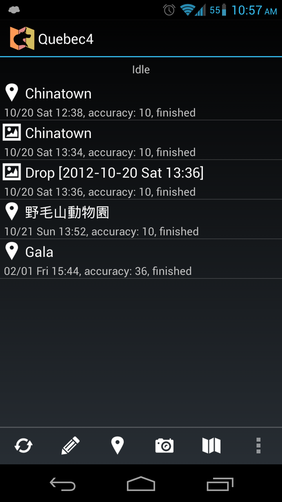
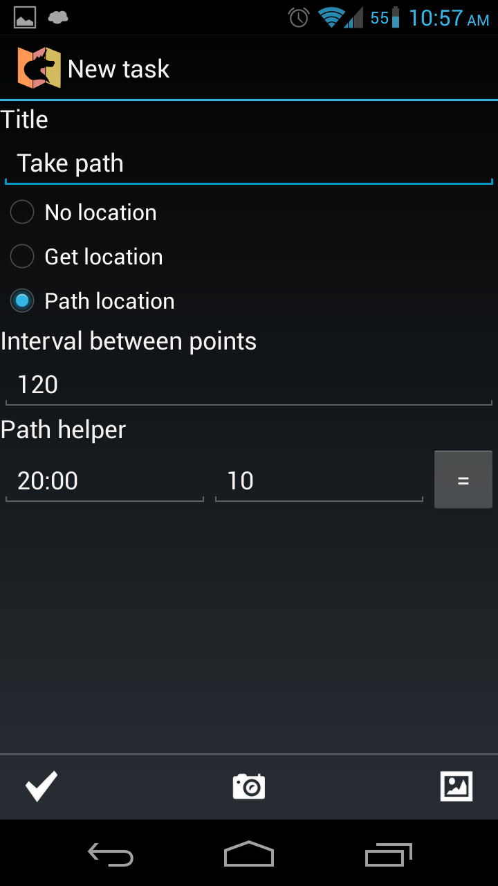
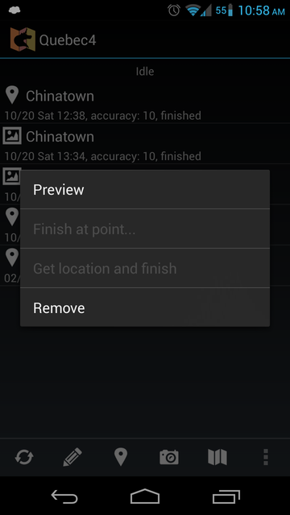
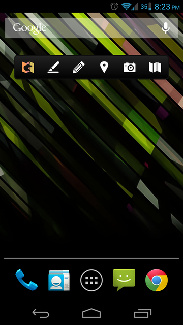

## Quebec4 - Media collector on Android device

### Main features
* Makes photos or imports media from Gallery
* Optionally adds Geo location
* Records paths by taking coorinates at specified interval
* Takes handwriting notes
* Publishes collected media via AIDL to other applications [AIDL](src-quebec4/org/kvj/quebec4/data/Quebec4Service.aidl)
* Has quick add panel widget

[Sierra5](https://github.com/kvj/Sierra5) application has a plugin for Quebec4 for importing media

### Screenshots

